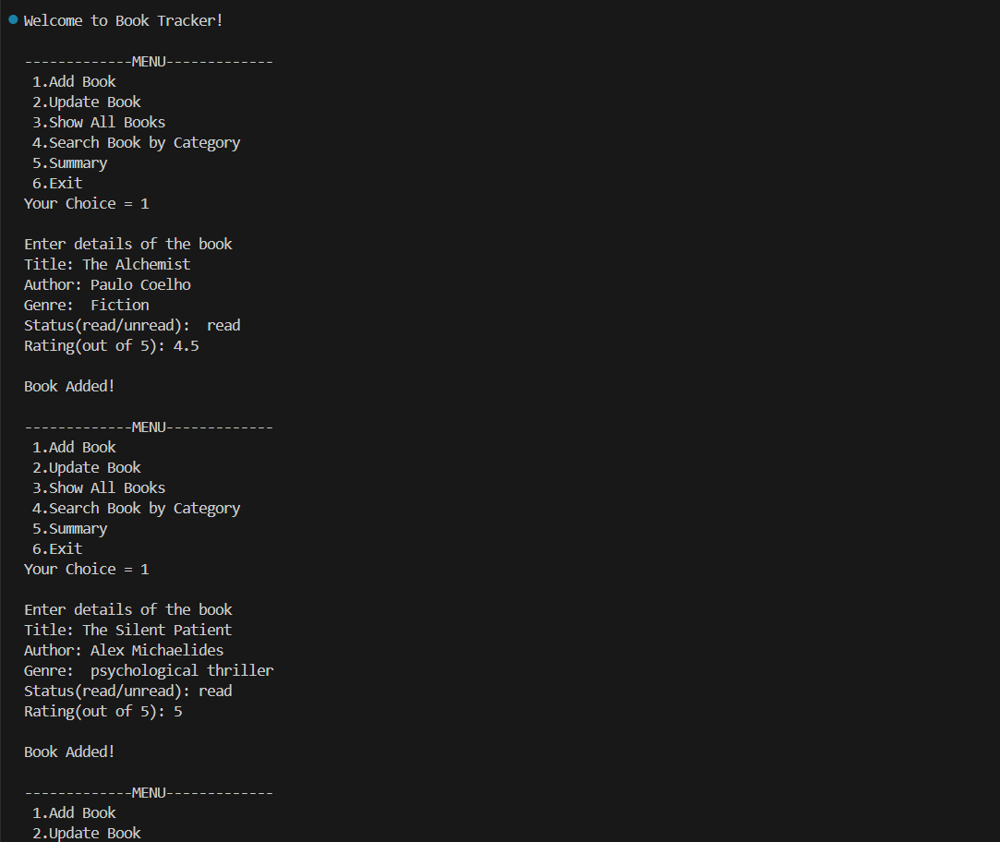
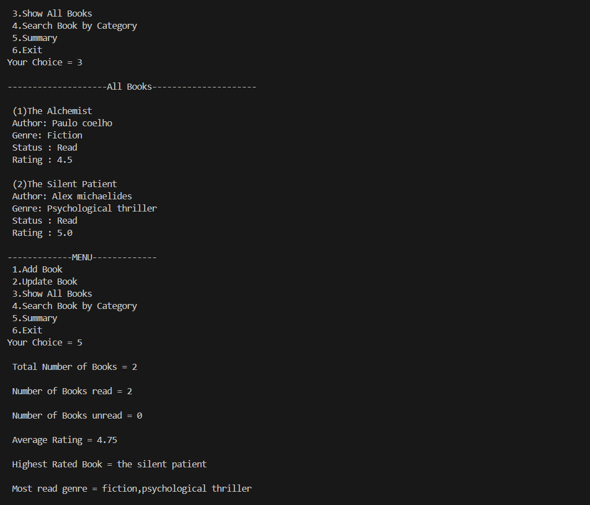
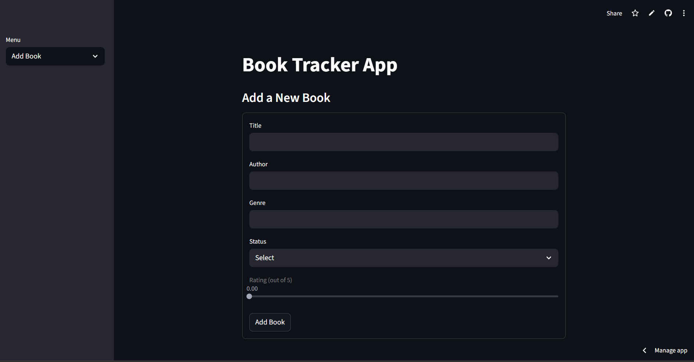

# Book Tracker

[](https://www.python.org/)
[](https://streamlit.io/)

A Python project to track books. This repository contains **two versions**:

1. **Console Version** – run in terminal/command prompt  
2. **Streamlit Version** – interactive web app

## Features

### Console Version
- Add, update, and view books via terminal
- Track book status (`read` or `unread`)
- View summaries: total books, read/unread count
- Search books by title, author, genre, or status

### Streamlit Version
- Interactive web interface with sidebar menu
- Add and update books with a dynamic form
- Compulsory rating for books marked as "read"
- View all books with detailed info
- Filter and search books by title, author, genre, status, or rating
- Summary section with:
  - Total books
  - Read/unread count
  - Average rating
  - Highest rated books
  - Most read genres

## Screenshots

### Console :



### Streamlit :



## Console Version

### Installation
1. Clone the repo:
   ```bash
   git clone https://github.com/Aparajita024/book-tracker.git
   cd book-tracker/console
2. Create a virtual environment:
    ```
    python -m venv venv
    source venv/bin/activate      # Windows: venv\Scripts\activate
3. Install dependencies:
    ```
    pip install -r requirements.txt
4. Run the program:
    ```
    python main.py
## Streamlit Version

### Installation
1. Navigate to the Streamlit folder:
    ```
    cd book-tracker/streamlit
2. Create a virtual environment:
    ```
    python -m venv venv
    source venv/bin/activate      # Windows: venv\Scripts\activate
3. Install dependencies:
    ```
    pip install -r requirements.txt
4. Run the Streamlit app:

    ```
    streamlit run app.py
## Online Deployment

The Streamlit app is deployed online here:

[Book Tracker](https://book-tracker-aparajita.streamlit.app/)

## Notes

- Each version has its own dependencies, so keep virtual environments separate.

- You can contribute by adding features, improving UI, or adding database support.

#
<p align="center"><a href="https://github.com/Aparajita024" target="_blank">@Aparajita024</a></p>